## 简介
想要做一个便携的小设备，能够实现以下功能
- 记录当前地点的气压，温度，湿度等地理信息
- 记录GPS坐标信息
- 考虑加上摄像头记录当前周围视觉环境，同时可以将上述信息水印（字幕)在照片上
- 存储所有记录的数据以便之后进行可视化数据生成，可以用类似XML，Json，或者找有没有嵌入式轻量数据库实现

它最好有以下这样的特点：
- 手机一般大小可以塞进口袋
- 一定程度的防摔防水外壳
- 续航可以接受2-3天一充电

所以我的打算用现有的能买到的小板子和单片机来做，预算不是大问题，大概1500-2000，（包含试错和学习成本）考虑过几种方向：
- ESP32
- 树莓派PICO
- 幸狐的板子和摄像头
- 树莓派Zero
最后发现现在目前树莓派zero2w的价格只有一百出头了，可能比某些arduino的原版板子还便宜，值得一试，幸狐看起来也不错的样子，回头再研究

下面这是树莓派zero2w跑通串口通信时的样子

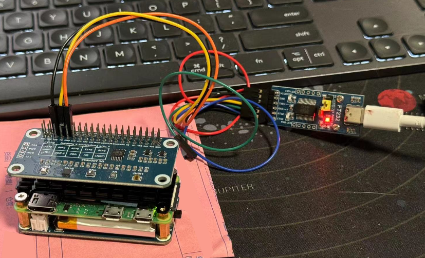

<!-- more -->

这个网站不错：https://pinout.xyz/

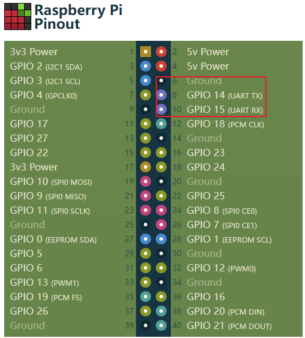

可知右上这几个接口就可以实现TTL的UART连接了，我尝试ground是要接的

## 资料
### FT232串口工具
https://www.waveshare.net/wiki/FT232_USB_UART_Board
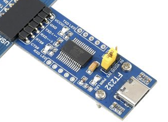
### GPS模块
https://www.waveshare.net/wiki/LC76G_GPS_Module
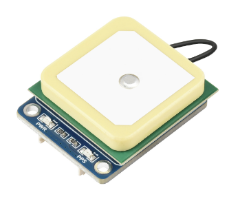
在准备安装micropyGPS时
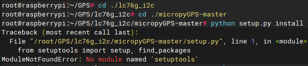
提示`No module namd setuptools`
怀疑需要执行
`apt-get install python3-setuptools`
可惜目前没有网络环境，回家尝试了
### Raspberry Zero 2W
https://www.waveshare.net/wiki/Raspberry_Pi_Zero_2_W
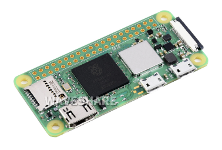
### UPS 模块
https://www.waveshare.net/wiki/UPS_HAT_(C)
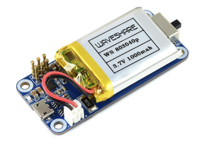
### 环境传感器
https://www.waveshare.net/shop/Environment-Sensor-HAT.htm
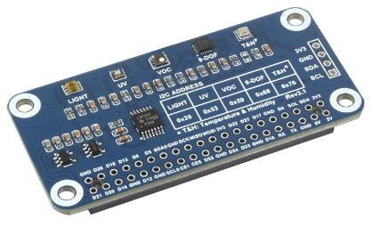

## 项目/软件
### 数据可视化相关
#### 很不错的开源教程Data-Science-For-Beginners
https://microsoft.github.io/Data-Science-For-Beginners/#/

#### Matplotlib
https://matplotlib.org/stable/index.html
Matplotlib是一个出色的库，可用于创建各种简单和复杂的图表
https://microsoft.github.io/Data-Science-For-Beginners/#/3-Data-Visualization/09-visualization-quantities/README
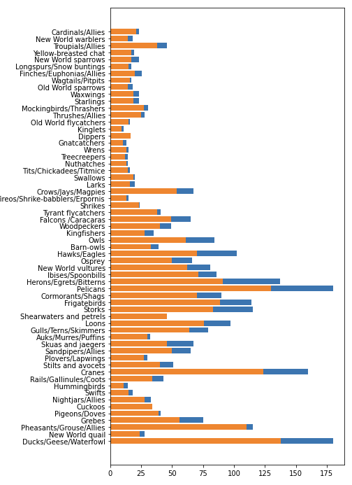

#### Streamlit
https://github.com/streamlit/streamlit
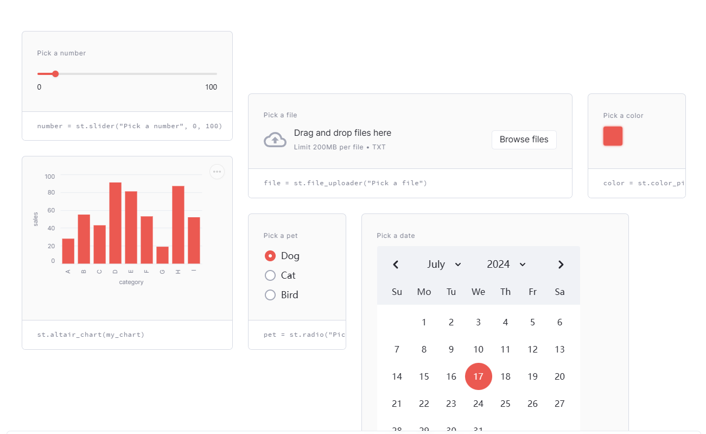
更偏向于python库直接生成web，同时也有很多数据可视化的内容，更实用？便于展示
#### powerbi
https://www.microsoft.com/en-us/power-platform/products/power-bi
似乎是微软的web数据可视化绘图

#### GPXSee
配合gps数据收集可以展示出来
https://github.com/tumic0/GPXSee
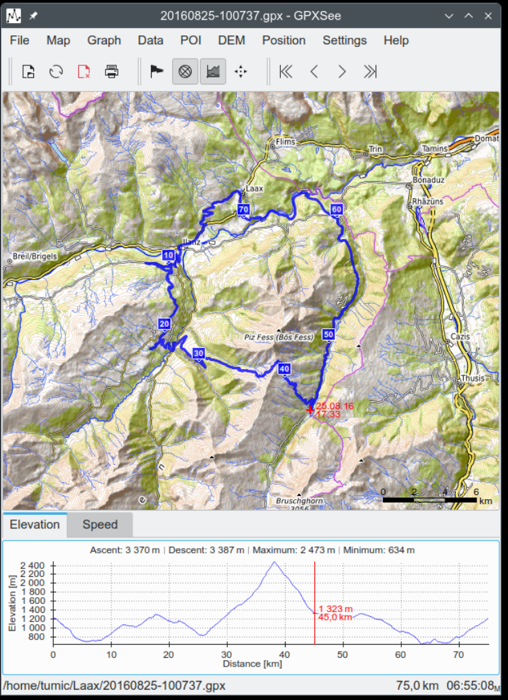

### 图形库
#### LVGL
https://lvgl.100ask.net/master/get-started/index.html
https://github.com/lvgl/lvgl
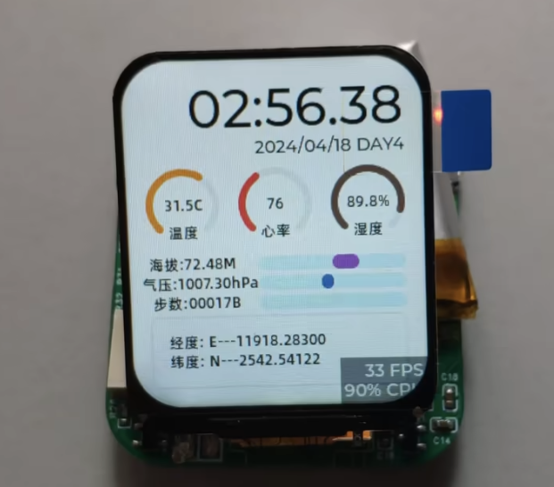

#### SquareLine Studio UI - 配合上面的LVGL用
https://squareline.io/
https://www.bilibili.com/video/BV1DX4y1v727/?vd_source=b7b7bdf106a064893c3c79e4a961f383

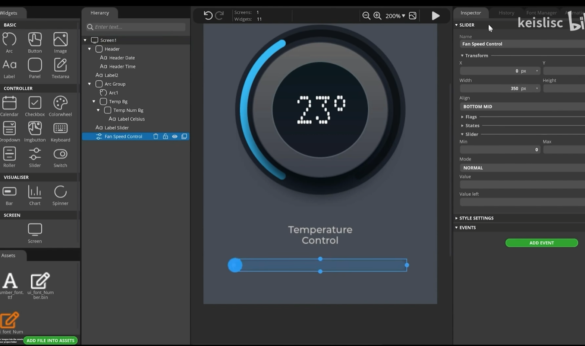

#### guiguider 同上类别但免费
https://www.bilibili.com/video/BV1yW421R7zK/?spm_id_from=333.788.recommend_more_video.7&vd_source=b7b7bdf106a064893c3c79e4a961f383
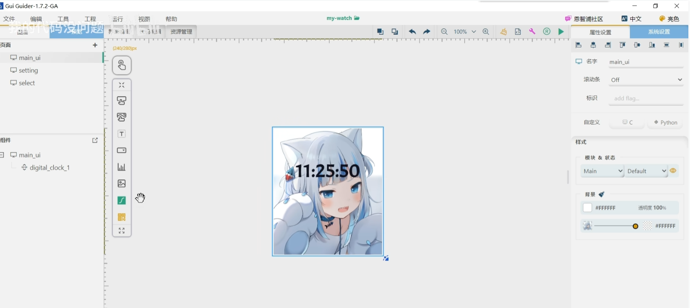
#### figma
UI前期设计软件
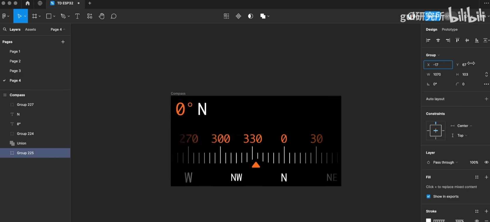

#### UI 框架：oled-ui-astra
https://github.com/AstraThreshold/oled-ui-astra
https://www.bilibili.com/video/BV1i4421D7nJ/?vd_source=b7b7bdf106a064893c3c79e4a961f383

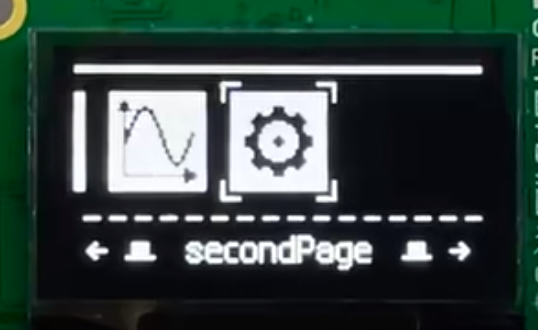