收集一些看到的好玩的可能以后会用到的软件/服务，软件类大多可以docker部署
不定期更新
24.8.6更新

## A.网站推荐
### 开源大世界
>开源大世界 专注于应用级的开源软件、开源资料的情报收集汇总整理。
[https://kydsj.vip/doku.php?id=wiki:网站目录#计算机辅助设计+](
https://kydsj.vip/doku.php?id=wiki:%E7%BD%91%E7%AB%99%E7%9B%AE%E5%BD%95#%E8%AE%A1%E7%AE%97%E6%9C%BA%E8%BE%85%E5%8A%A9%E8%AE%BE%E8%AE%A1+)
[https://kydsj.vip/doku.php?id=wiki:自托管-电子书和综合图书馆系统](https://kydsj.vip/doku.php?id=wiki:%E8%87%AA%E6%89%98%E7%AE%A1-%E7%94%B5%E5%AD%90%E4%B9%A6%E5%92%8C%E7%BB%BC%E5%90%88%E5%9B%BE%E4%B9%A6%E9%A6%86%E7%B3%BB%E7%BB%9F)

很多开源软件项目分享，分类详细品种丰富
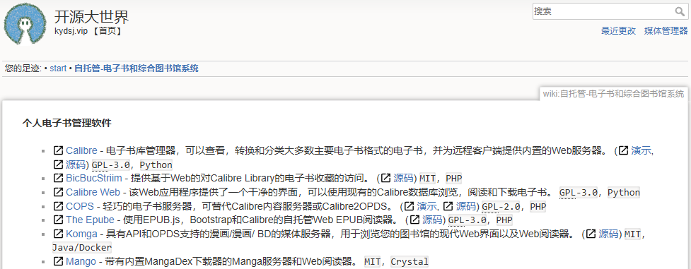

### linuxserver.io
 >LinuxServer.io 文档之家！我们的目标是确保所有镜像都正确记录所有相关信息，以帮助我们的用户入门。除了每个镜像的单独设置指南外，还有与运行 Docker 容器有关的一般信息和最佳实践
 https://docs.linuxserver.io/images/docker-calibre-web/

 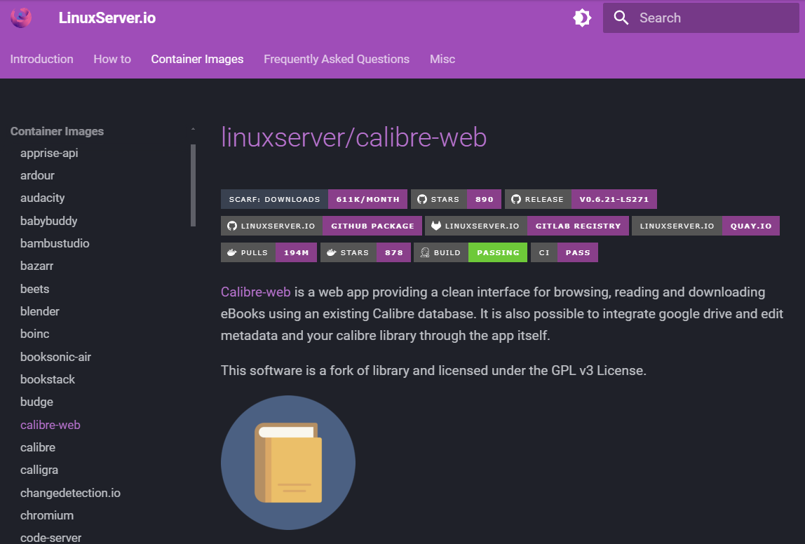

 <!-- more -->

### webpagetest.org
>www.webpagetest.org

感觉是很强的网站性能分析工具
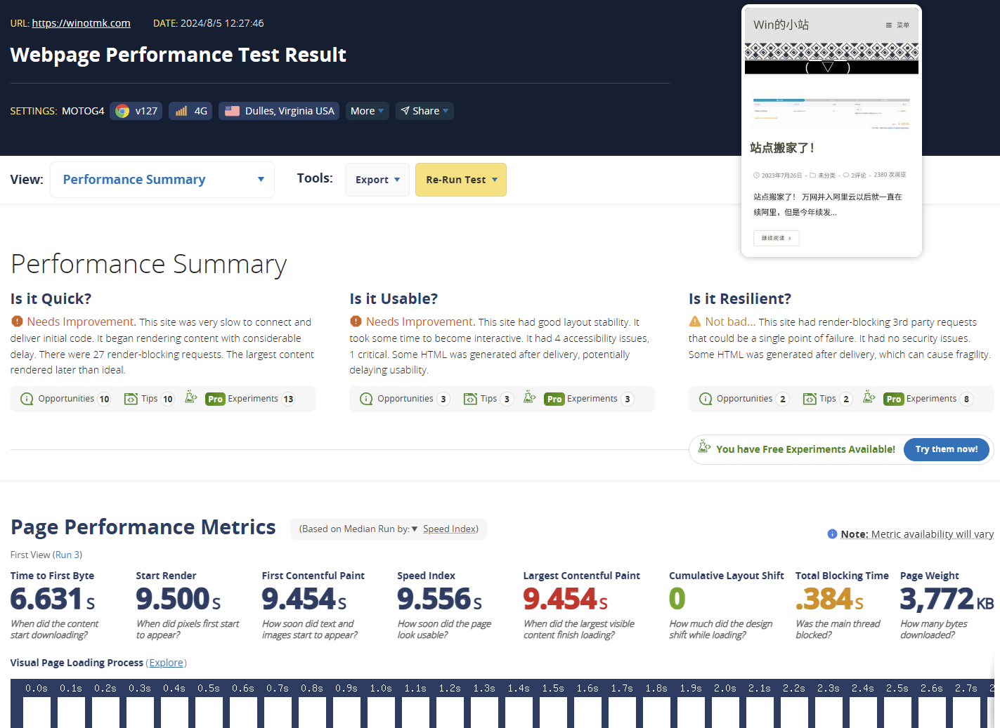
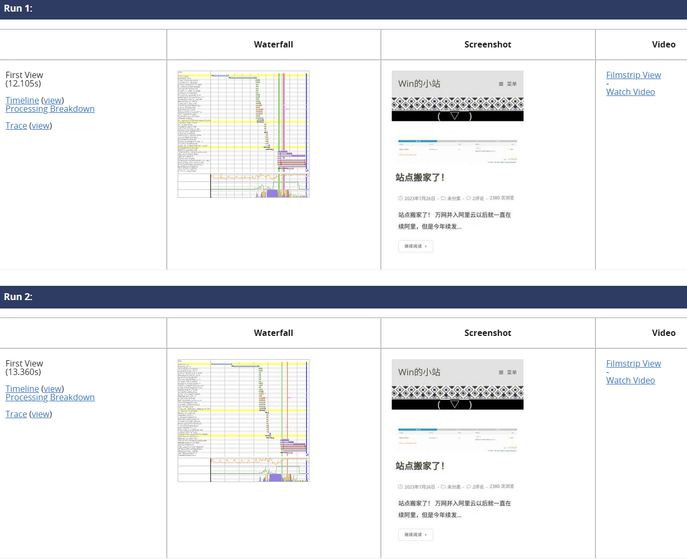

### 又拍云
https://www.upyun.com/

### autodl
https://www.autodl.com/market/list

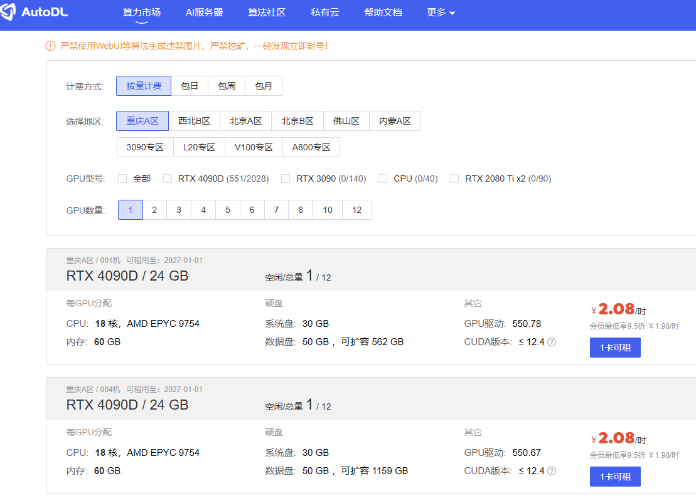

## B.影音/文件/资料整理
### emby

>任何设备上的个人媒体
将您家里的所有视频、音乐和照片集中到一处从未如此简单。您的个人 Emby 服务器会自动即时转换和流式传输您的媒体，以便在任何设备上播放
https://github.com/MediaBrowser/Emby?tab=readme-ov-file
https://emby.media/

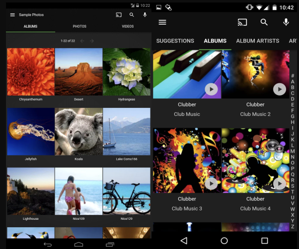

### jellyfin

>jellyfin是一套多媒体应用程序软件套装，旨在组织、管理和共享数字媒体文件
https://github.com/jellyfin/jellyfin
https://jellyfin.org/

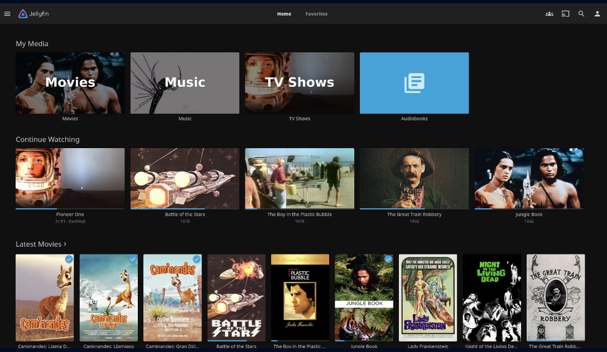

### calibre

>Calibre-Web 是一款网络应用程序，它使用有效的Calibre数据库提供简洁直观的界面来浏览、阅读和下载电子书
https://github.com/janeczku/calibre-web
https://calibre-ebook.com/
目前自用的docker镜像：
https://hub.docker.com/r/johngong/calibre-web

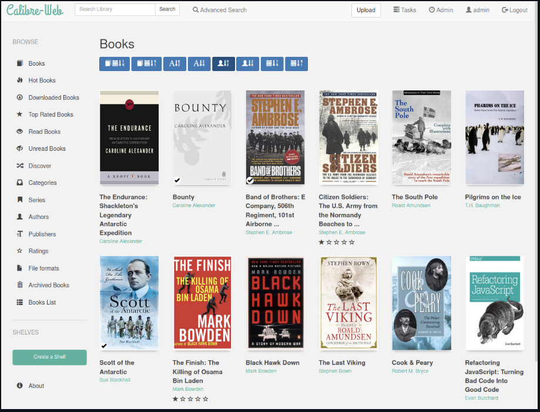

### Nextcloud

>Nextcloud是一套用于建立网络硬盘的客户端－服务器软件。其功能与Dropbox相近，但Nextcloud是自由及开放源代码软件，每个人都可以在私人服务器上安装并执行它。
>与Dropbox等专有服务相比，Nextcloud的开放架构让用户可以利用应用程序的方式在服务器上新增额外的功能，并让用户可以完全掌控自己的资料。
https://github.com/nextcloud
https://nextcloud.com/

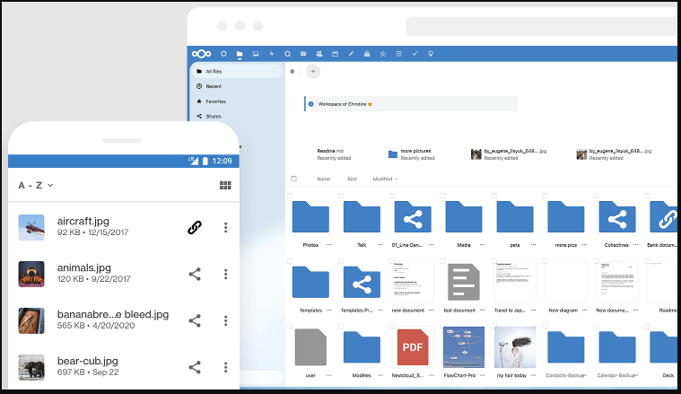

### Found
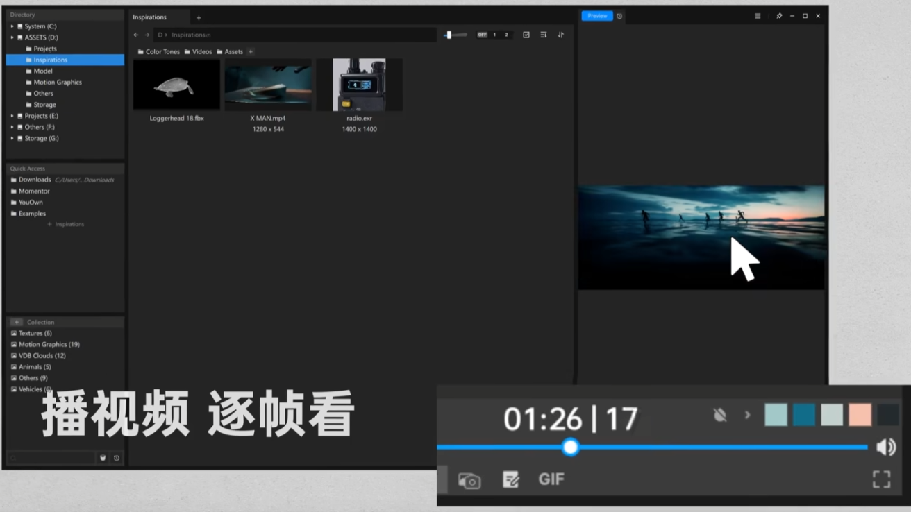
>高效设计师必备的文件浏览器 Found，一键预览三维模型、序列帧、HDR
https://www.aalab.com.cn/

## C.工具类
### matomo

>Matomo 是领先的免费/自由开放分析平台。
>
>Matomo 是一款功能齐全的 PHP MySQL 软件程序，您可以下载并安装在自己的网络服务器上。在五分钟的安装过程结束时，您将获得一个 JavaScript 代码。只需将此标签复制并粘贴到您希望跟踪的网站上，即可实时访问您的分析报告。
>
>Matomo 旨在成为 Google Analytics 的免费软件替代品，目前已在 1,400,000 多个网站上使用。隐私功能已内置
https://github.com/matomo-org/matomo
https://matomo.org/

### Upverter
>Upverter 是一个模块化的、基于网络的电子电路设计工具，可以完成所有工作——PCB 设计、原理图、自动布线、3D 预览和按照您的确切规格构建订单——用户不再需要为开源项目付费。
https://upverter.com/

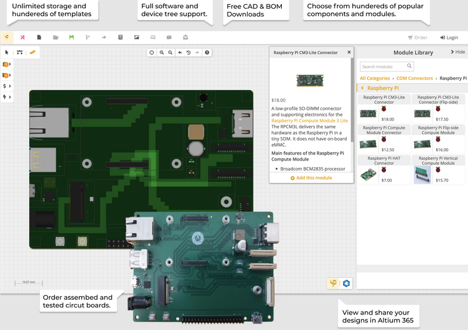
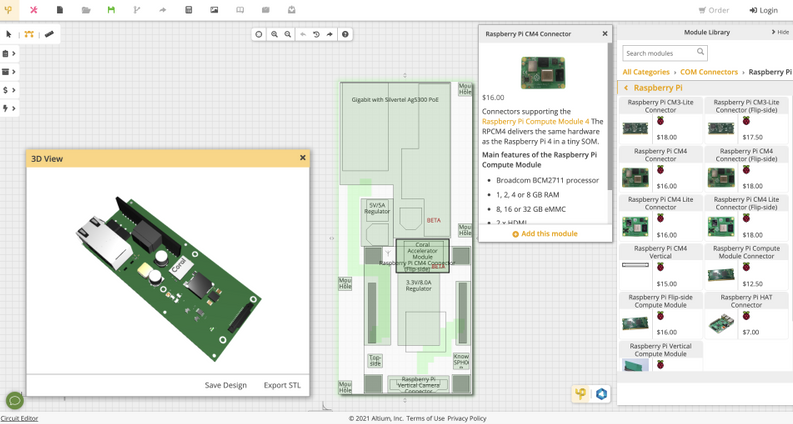

### manim
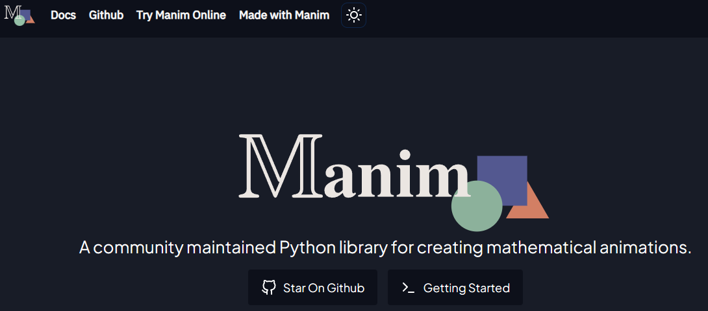
https://www.manim.community/

可以做出3B1B那样好看的数学动画（可以用来做视频的工具)
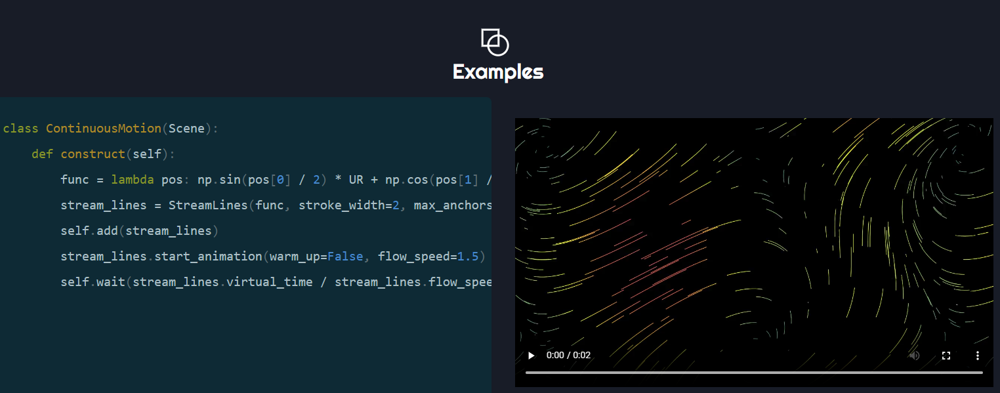

