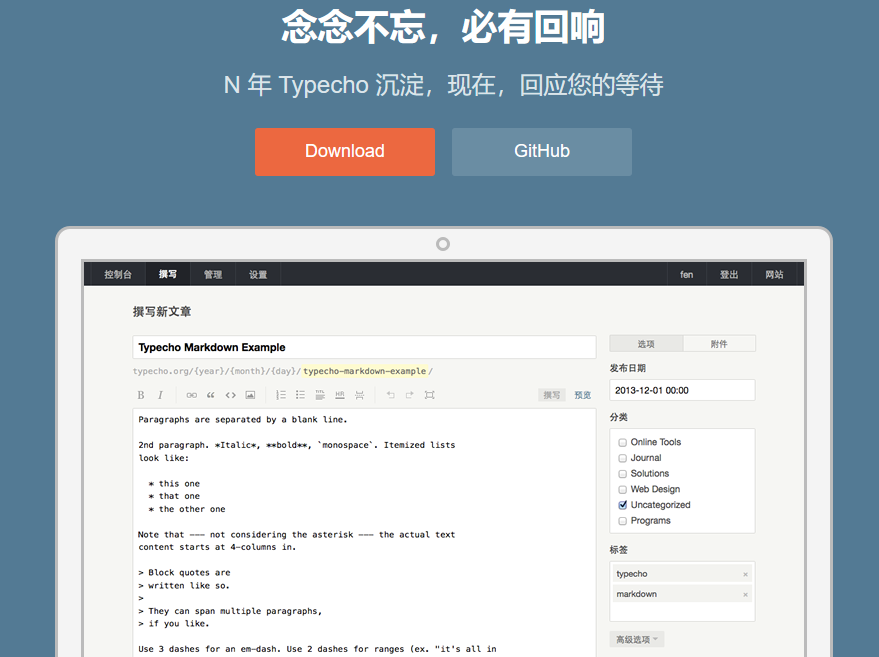

其实自己很长一段（接下来将来可能也会）时间内有两个网站，一个是习惯稍微正式点的东西写在：
https://www.winotmk.com/
是我的第一个网站，基于wordpress的，买的包年虚拟服务器，但很多内容年久失修，而且刚架设的时候什么也不知道，一点点摸通服务器，备案，注册域名之类的，那会儿还挺流行wordpress，似乎也没有别的更多的选择
同时还有一个
https://md.winotmk.com/
(https://winotmk.github.io/)
由hexo驱动的纯静态md文档网站，比较随意，想到啥写啥，构建方式也比较特别，是运行在云服务的容器里，静态文章则是在阿里云nas存储里，网站生成后托管在github，同时cdn加速
似乎md站可以用更放松的心情去记录，慢慢的文章比主站还多了？！

因为目前主站的各种小毛病（也不是不能用）所以经常考虑要不要把它换套别的结构，网上一搜确实有比如一键wordpress转hugo的方案，总之先记着，不一定用。因为当初20块买了套便宜的wordpress皮肤，然后在此基础上魔改各种css，已然改成了忒修斯之船，全丢弃了还是挺可惜的（沉没成本2333

## 网站生成/框架
### typecho

> Typecho 是一款基于 PHP 的博客软件，旨在成为世界上最强大的博客引擎
https://github.com/typecho/typecho
https://typecho.org/

这个好在和wordpress一样也是PHP的，想必能很快的迁移过来吧，而且目测更轻量，就是可能还是得租虚拟服务器了

 <!-- more -->

预览博客：
https://xhhdd.cc/index.php/archives/27/
https://cfanlost.com/

### hugo
https://gohugo.io/

似乎是类hexo生成静态网页，然后可以塞到github托管的

### pelican
>Pelican 是一个用Python编写的静态站点生成器，允许您通过编写 Markdown、reStructuredText 和 HTML 等格式的文本文件来创建网站
https://github.com/getpelican/pelican

听起来类似hexo和hugo，只是一个nodejs，一个go，这个则是python做的（真好啊

### jekyllrb
>将纯文本转换为静态网站和博客
https://jekyllrb.com/

应该和上面类似，同样是静态文章生成，部署到github

预览博客：https://jaminzhang.github.io/linux/Change-Linux-System-Locale-Envs/

## 皮肤/主题
### typecho
#### handsome
https://www.ihewro.com/archives/489/

### pelican
#### attila
https://github.com/arulrajnet/attila

预览博客：https://leonis.cc/sui-sui-nian/2023-10-31-cloudflare-dns-of-blog.html

### hugo
#### PaperMod
https://themes.gohugo.io/themes/hugo-papermod/

Demo:https://adityatelange.github.io/hugo-PaperMod/

## 评论系统
### waline
https://github.com/walinejs/waline

### utterances
是一个基于GitHub issues的轻量级评论，用github登录
https://utteranc.es/

