最近找到个整合包（因为懒得一个个翻bbs
https://www.bilibili.com/read/cv7403697/?spm_id_from=333.999.collection.opus.click
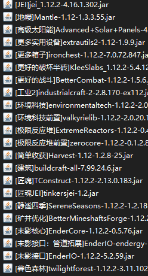
这包里的mod和之前自己开的服务器高度相似，太棒啦，从1.7.10直升1.12.2，基本还都是熟悉的味道
才知道mcbbs已经无了，然后才可发现mc百科已经这么好用了，连接直连发布curseforge和github，省去搬运步骤，也蛮好的！
服务端有了，想通过docker容器部署到我的群晖NAS上，DS720+扩容了根16G内存条放着也是放着
## 选取docker镜像
docker hub里有官方镜像，用的是这个，体积精简，只运行环境jre就够了
https://hub.docker.com/_/openjdk/tags?page=1&page_size=&name=8u342&ordering=
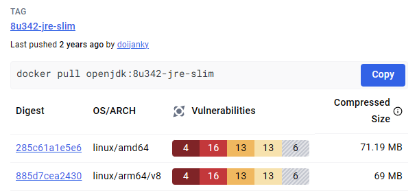
所以直接
```
docker pull openjdk:8u342-jre-slim
```
然后直接这样运行就好了
```
docker run -it -d \
-p 25565:25565 \
-v E:\game\MC\1.12.2mohist_服务端:/mc \
-w /mc \
--name MC1122 \
openjdk:8u342-jre-slim \
java -Xms2G -Xmx8G -XX:+UseG1GC -XX:+AggressiveOpts -XX:+UseCompressedOops -jar Mohist-1.12.2-c950429-server.jar nogui
```
虽然长，但是总的来说挺简单，用`openjdk:8u342-jre-slim`镜像运行`java`命令罢了，但是！
出现了一个人让人感觉不爽的小问题，服务端的log输出以及游戏内服务端来的输出都是英文的，这在之前直接windows运行时不是这样的，所以第一反应是语言环境问题
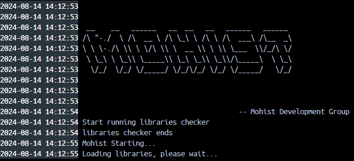
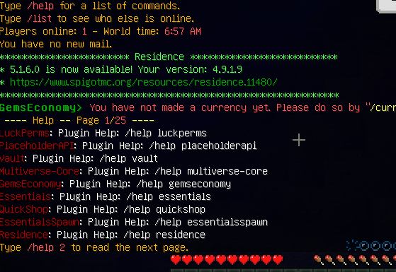
## 设置环境变量
在`docker run`的时候加上个参数`-e LANG="zh_CN.UTF-8"`，类似`export  LANG=zh_CN.UTF-8`
确定环境变量生效了：
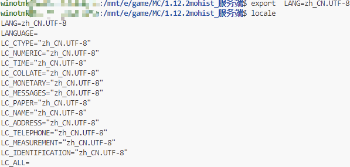
但没解决问题，反而似乎导致启动的时候不认识中文的mod文件名了

在查找这个之后：[docker 容器设置中文环境](https://blog.csdn.net/myli92/article/details/139909499?csdn_share_tail=%7B%22type%22%3A%22blog%22%2C%22rType%22%3A%22article%22%2C%22rId%22%3A%22139909499%22%2C%22source%22%3A%22unlogin%22%7D)
发现单纯设置`LANG`的变量不行，容器里就没有中文字符集的
### 查看已有语言
```
locale -a
```
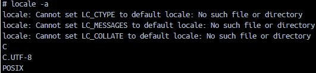

### 安装中文环境
[使用DockerFile的方式快速构建一个基础镜像，解决中文环境问题](https://blog.csdn.net/star1210644725/article/details/108747049)
所以安装中文环境的命令可以是：
```
apt-get install -y language-pack-zh-hans
```
但这样不行！因为这个是ubuntu的命令，查看我的docker镜像的信息发现是以debian基底的
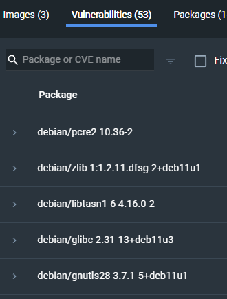

看到:[Debian系统安装中文包](https://blog.csdn.net/forever_008/article/details/103720389)
```
dpkg-reconfigure locales
```
然后再选`zh_CN.UTF-8`，可行，但是集成到镜像里没那么好使，还好有别的方法


## 制作新镜像
参考：[dockerfile文件中给debian设置中文支持](https://blog.csdn.net/wyazyf/article/details/90676364)
### dockerfile
```
FROM openjdk:8u342-jre-slim
RUN apt-get clean && apt-get update && apt-get install -y locales &&  localedef -c -f UTF-8 -i zh_CN zh_CN.utf8
WORKDIR /mc
ENV LANG zh_CN.UTF-8
```
保存为dockerfile文件然后
```
docker build -t jre8u342_ch .
```
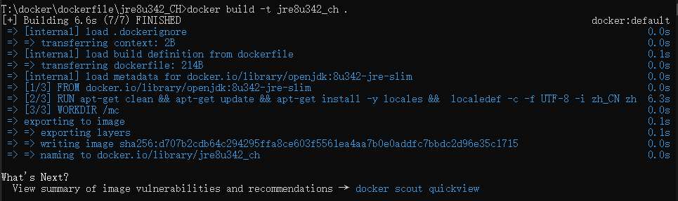
### 测试运行
```
docker run -it -d \
-p 25565:25565 \
-v E:\game\MC\1.12.2mohist_服务端:/mc \
--name MC1122 \
jre8u342_ch:latest \
java -Xms2G -Xmx8G -XX:+UseG1GC -XX:+AggressiveOpts -XX:+UseCompressedOops -jar Mohist-1.12.2-c950429-server.jar nogui
```
因为dockerfile里已经设置过`WORKDIR`了所以不需要`-w`参数

这下不会报英文了
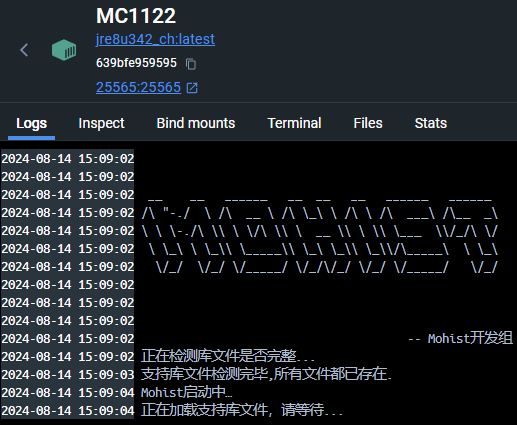
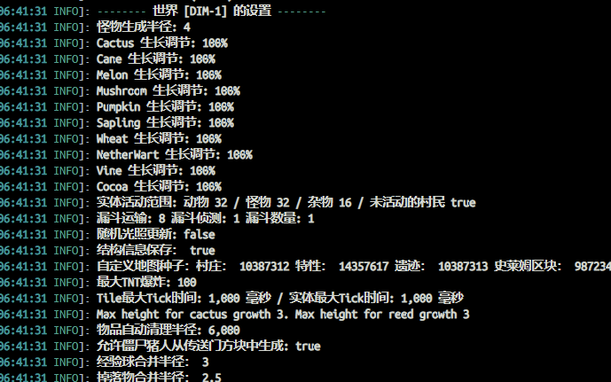
游戏里也是中文环境的返回信息
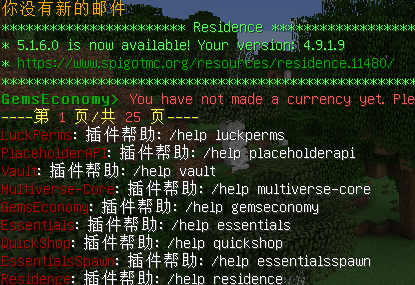


## 部署到群晖
先把做好的镜像打包出来，方便传到群晖NAS里
```
docker save -o jre8u342_ch.tar jre8u342_ch:latest
```
先导入这个镜像
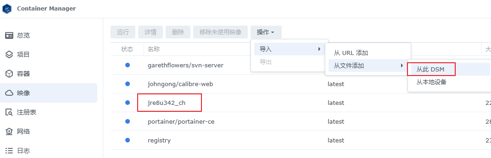
然后简单配置一下端口和mc服务器目录就可以了,和上面的`docker run`其实是一样的
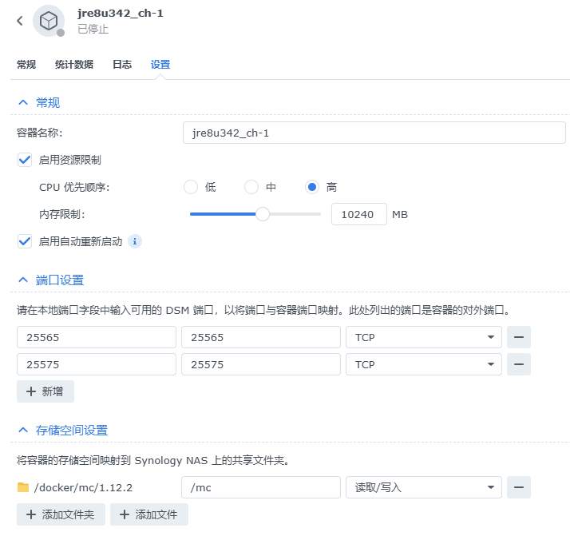
端口的`25565`是游戏端口`25575`用作管理，下面会提到

## 服务器远程管理
用容器托管运行了，上哪去敲`/op xxxx`和`/stop`之类的管理命令呢？
可以用rcon方案！
https://wiki.vg/RCON
具体就是用这个软件：
https://github.com/Tiiffi/mcrcon


### 安装和服务端配置：
```
git clone https://github.com/Tiiffi/mcrcon.git
cd mcrcon
make
sudo make install
```

然后服务端也要配置一下，在`server.properties`里的
```
enable-rcon=false
```
改为
```
enable-rcon=true
rcon.password=your_passwd
rcon.port=25575
```
### 用法：
先连接
```
mcrcon -H 服务器地址 -p your_passwd
```
然后就可以一样敲各种minecraft管理命令了

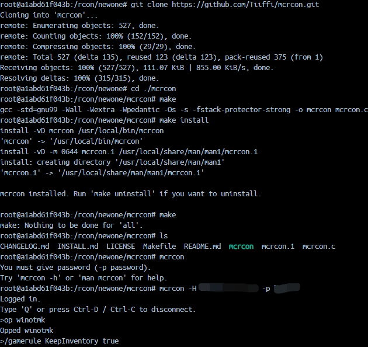

好了不说了博主我要去挖矿开荒了
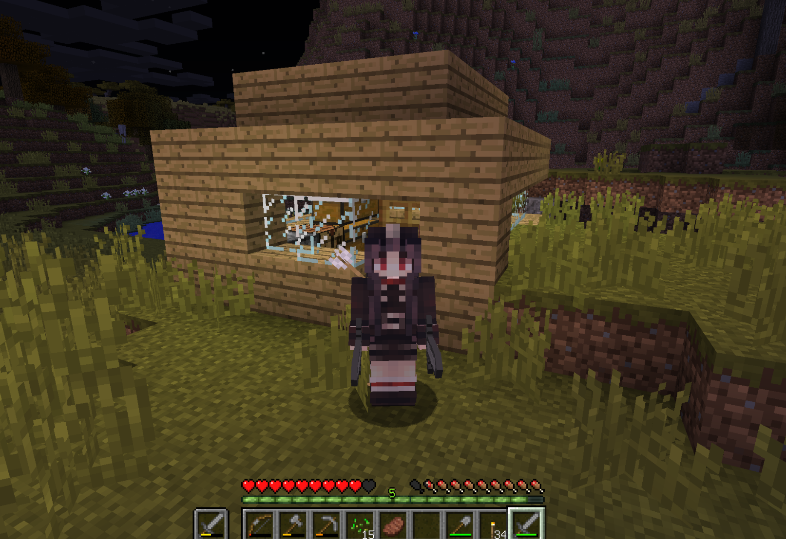
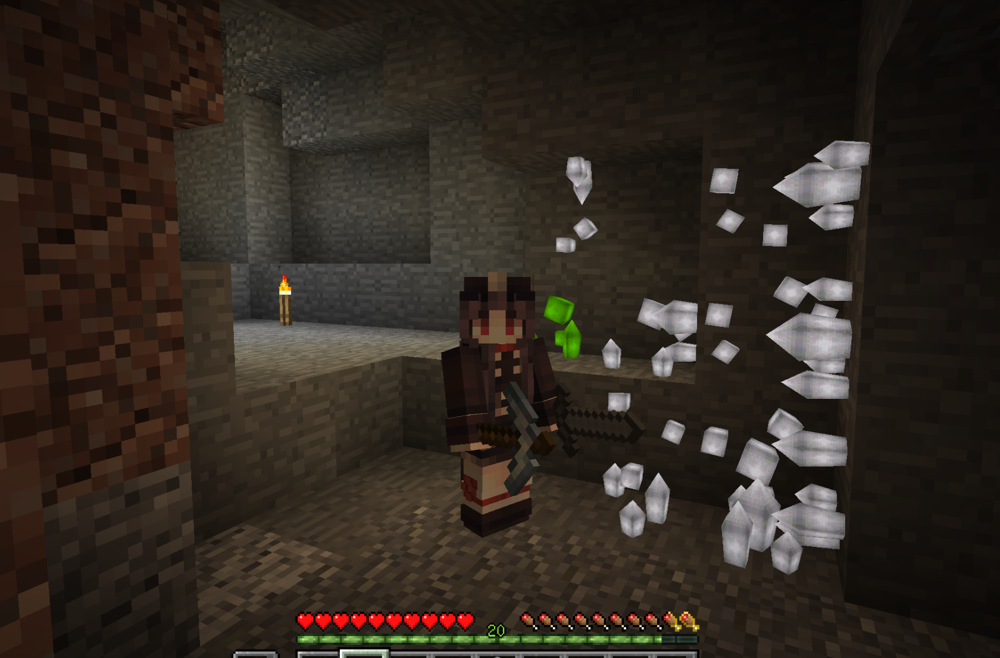


## 参考
debian文档，第 8 章 国际化和本地化：
https://www.debian.org/doc/manuals/debian-reference/ch08.zh-cn.html#_rationale_for_utf_8_locale


类似的打包好的docker环境MC服务器镜像有：
https://github.com/itzg/docker-minecraft-server/tree/master
对我来说功能有点多，只是参考参考