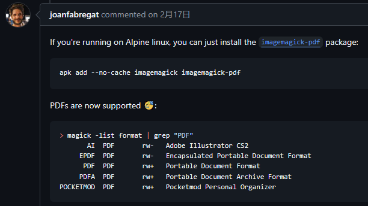
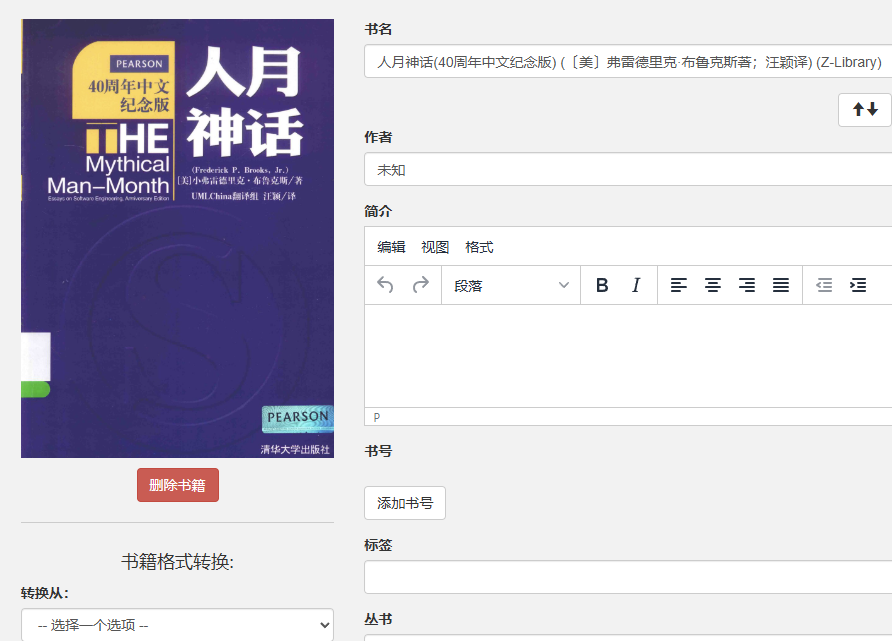

在用`johngong/calibre-web:latest`这个镜像 https://hub.docker.com/r/johngong/calibre-web
作为自己nas上的图书馆时发现pdf文件无法生成封面，


断断续续排查了两周，百思不得解，尝试过：
* 设置imagemagick的`policy.xml`文件(`/etc/Imagemagick/policy.xml`)
* 使用lscr.io/linuxserver/calibre-web:latest的镜像
* 自己重新构建镜像
* 重新安装calibre-web包和重装imagemagick包
都解决不了，总之是十分折腾，最后认为可能是`johngong/calibre-web:latest`可能是里少了一个`imagemagick-pdf`包

## 最终有效的解决方法的折腾流程
我尝试上传pdf文件，然后打开日志（日志级别设置为DEBUG）

查看文件：/config/calbre-web/calbre-web.log
有这么一行：

```
[2024-09-25 12:10:22,144]  WARN {cps.uploader:237} Cannot extract cover image, using default: no decode delegate for this image format `PDF' @ error/constitute.c/ReadImage/746
[2024-09-25 12:10:22,145]  WARN {cps.uploader:238} On Windows this error could be caused by missing ghostscript
```
PDF转就转不出来
所以找到了：

https://github.com/ImageMagick/ImageMagick/issues/6148
```
apk add --no-cache imagemagick imagemagick-pdf
```
安装完以后，再次尝试上传pdf格式的书，就看见封面辣！！


<!-- more -->

## johngong/calibre-web的一些设置
https://github.com/gshang2017/docker/issues/133
如果一编辑图书的元数据就卡死，可用尝试：

这两条设置为true,则

这里不会出现google等选项，家里的nas没有梯子环境，反而会导致卡死，所以禁用google吧。。也没啥用

## 弯路
这里想记一下这个弯路，在calibre-web的FAQ里赫然记着有关pdf文件转不出封面的解决办法，说要改

https://github.com/janeczku/calibre-web/wiki/FAQ#what-to-do-if-cover-pictures-are-not-extracted-from-pdf-files
所以可以有`/etc/Imagemagick/policy.xml`:
```
<policymap>
    <policy domain="coder" rights="read | write" pattern="{MSVG,MVG,PS,PDF,RSVG,SVG,XPS}" />
</policymap>
```
这是最容易找到的一种解法，但我自己试了无用，没有上面的装`apk add imagemagick-pdf`好使

## 尝试出来的另一种PDF封面提取可行方法
这样做出来的calibre-web镜像可以实现PDF转换，但是没有电子书格式转换，没有禁用google元数据搜索，没有中文环境，懒得自己做了，还是修修用`johngong/calibre-web`包吧
为了试验，我用`FROM ubuntu:latest`作为镜像基底，然后：
### 装calibre-web
安装calibre-web：

https://github.com/janeczku/calibre-web?tab=readme-ov-file#installation
https://github.com/janeczku/calibre-web/wiki/Dependencies-in-Calibre-Web-Linux-and-Windows
这里也有提到
https://chenjiehua.me/others/calibre-web-personal-book-store.html

```
pip install calibreweb
pip install calibreweb[metadata]
```

### 装imagemagick
然后安装imagemagick
官方：
https://imagemagick.org/script/download.php
也有提到：
https://www.cnblogs.com/echohye/p/17727865.html

```
apt install imagemagick
```
装完后`convert`和`magick`命令应当是可用的
### 手动装imagemagick
或者我用上面官方的magick文件手动配貌似也行：
先把magick文件放入根目录
```
./magick --appimage-extract
```
https://docs.appimage.org/user-guide/troubleshooting/fuse.html
提到了可以用`--appimage-extract`直接释放出软件包来
会发现释放出来文件在`/squashfs-root`目录里
设置环境变量：
```
export MAGICK_HOME="/squashfs-root/usr"
export PATH="$MAGICK_HOME/bin:$PATH"
export LD_LIBRARY_PATH="${LD_LIBRARY_PATH:+$LD_LIBRARY_PATH:}$MAGICK_HOME/lib"
```
然后imagemagick应该就能用了。。

### 其他
`lscr.io/linuxserver/calibre-web:latest`
这个镜像也不小，但功能还算完整，上传pdf可直接显示封面，但不是中文环境，而且部署到我的nas上后死活传不了新书说什么无法写入，懒得深究了，弃之