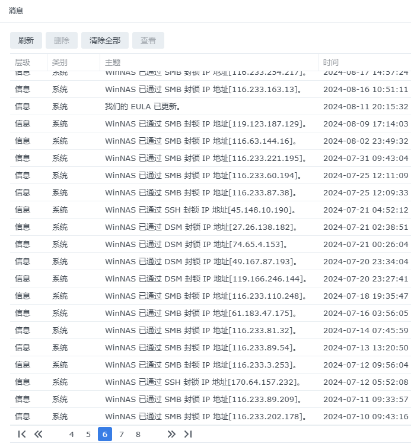
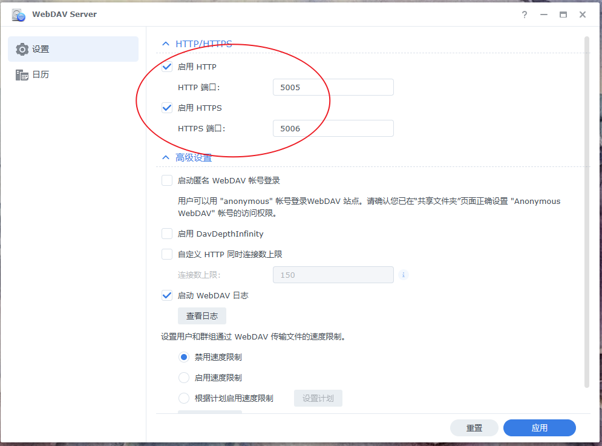
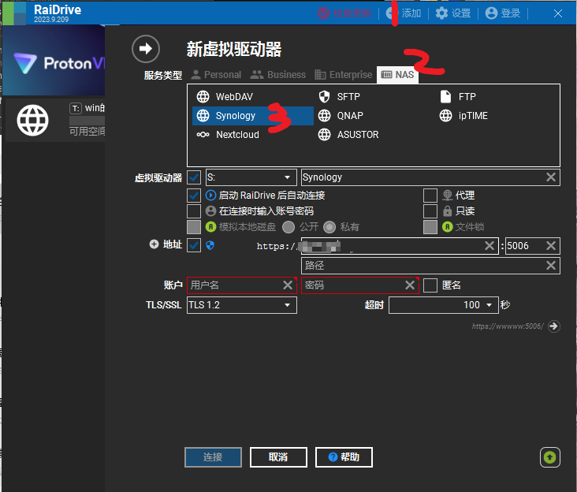
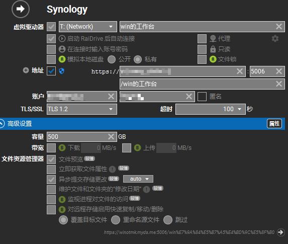
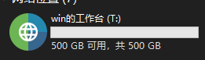

## 方法一：开SMB文件服务再映射端口
在这里打开SMB

然后在路由器里打开端口转发，需要``137-139,445``这么几个端口，我是路由拨号已有公网IP

这样的好处就是相对简单，不需要客户端再装软件windows自带即可连接，当然需要NAS有公网IP（或者再做穿透）

缺点：坏处就是，这个几个端口似乎非常**不安全**，在我转发这几个端口后，可以看到一直有IP尝试钻进来被NAS封，而且如果想要改这几个端口似乎不是那么容易的懒得研究啦

某天在公司忽然死活连不上后（内网还可以访问，说明SMB服务没问题，也许被运营商封端口了？），尝试另一种访问文件的方法

## 方法二：WeaDAV+RaiDrive客户端
首先NAS上装WeaDAV，设置一下：

路由器里转发这俩端口就可以
然后pc安装RaiDrive这个软件，设置如下：

即可成功挂载一个带盘符的网络驱动器，试了下稳定性还是不错的，速度和SMB无异，用起来也没啥区别
缺点：开机得启动RaiDrive这个软件，而且似乎读不了正确的NAS容量大小（500g是我自己填的)

