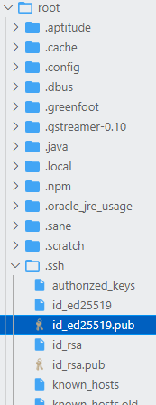
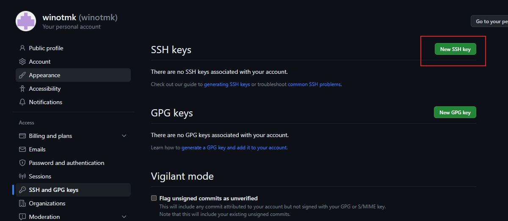
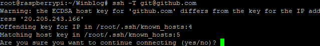
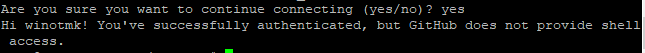

## 生成秘钥
```
ssh-keygen -t ed25519 -C "550330147@qq.com"
```
邮箱自然是我的git注册邮箱
## 如果修改passphrade密码
```
ssh-keygen -p -f ~/.ssh/id_ed25519
```
直接enter即密码为空，这是秘钥的密码
## 复制秘钥到github

打开/root/.ssh/id_ed25519.pub
复制到这里

https://github.com/settings/ssh/new

PS官方已不推荐用rsa加密

## 测试
```
ssh -T git@github.com
```

这里输入yes

成功！