事先：我是用路由拨号所以家里已经有外网直连IP，且配置了DDNS和端口转发，所以一个域名即可连上NAS
另外我的群晖是DS720+，是块X86intel的CPU，所以和PC一样用X86的容器镜像就可以，如果是ARM机NAS应该是不通用的

所用镜像：https://hub.docker.com/r/garethflowers/svn-server
备选镜像（看起来也很不错，拉取次数也过1M：https://hub.docker.com/r/elleflorio/svn-server

SVN网站：https://subversion.apache.org/

参考：
https://blog.51cto.com/u_12701820/6544028

## 准备镜像

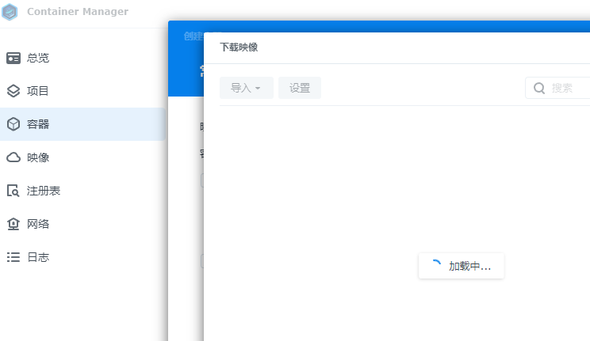
由于在群晖的ContainerManager里直接添加镜像不能，应该是要配个docker的镜像站加速或者整个NAS在梯子环境里，懒得整了，我这次选择PC上保存镜像包再拖来NAS里用的形式，个人感觉更方便些

先在PC上拉个镜像，直接
```
docker pull garethflowers/svn-server:latest
```
然后把镜像打包成文件
```
docker save -o svn-server.tar garethflowers/svn-server:latest
```

<!-- more -->

就能得到一个`svn-server.tar`的文件了，把这个文件上传到ContainerManager里
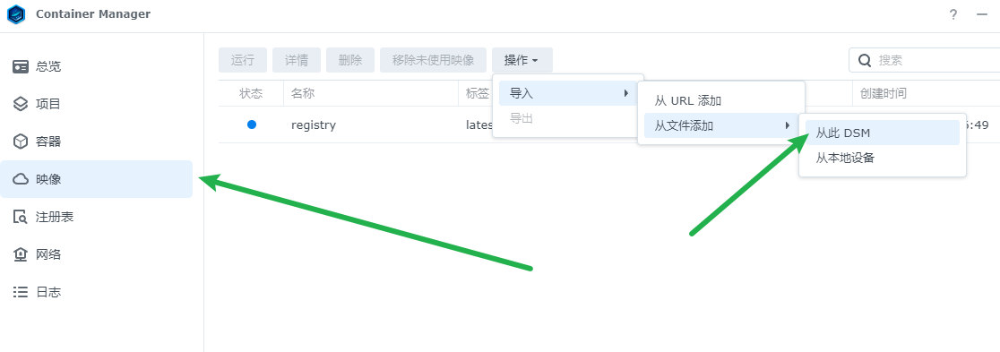
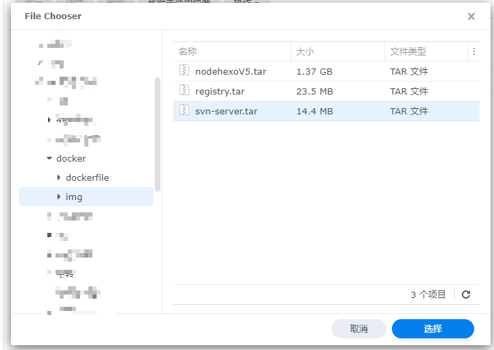

然后左边的TAG里选容器》新增，选择刚上传的svn-server
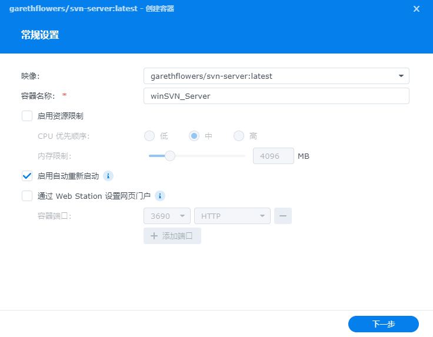

## 配置镜像
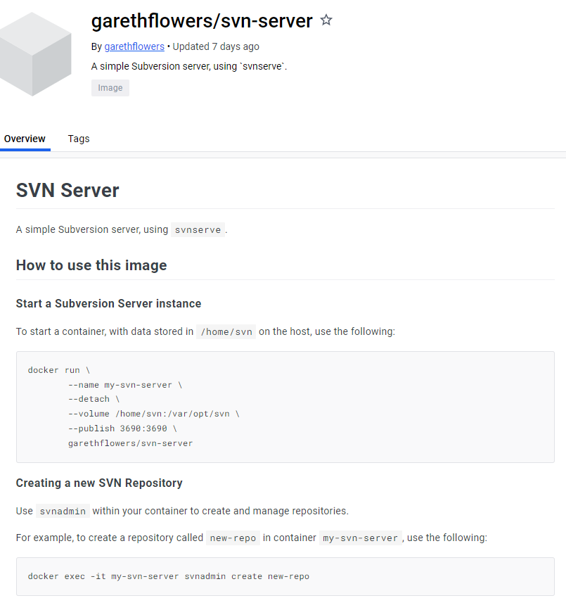
镜像用法说明，基本上配置个端口和映射库就行
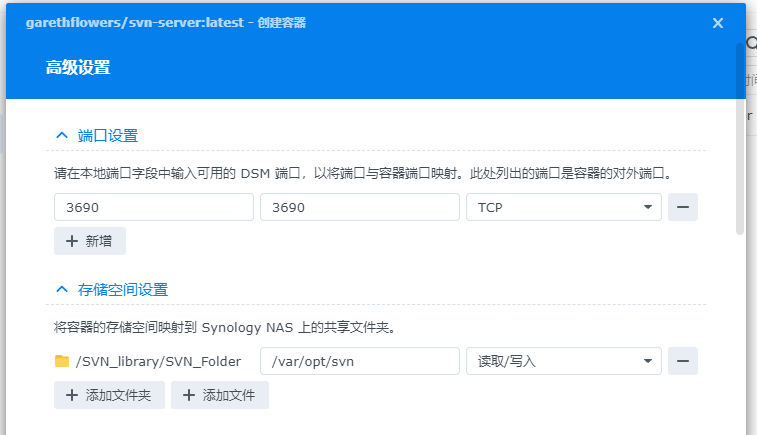
`/SVN_library/SVN_Folder`是我专门创建的新的NAS文件夹

之后下一步容器就能启动起来了

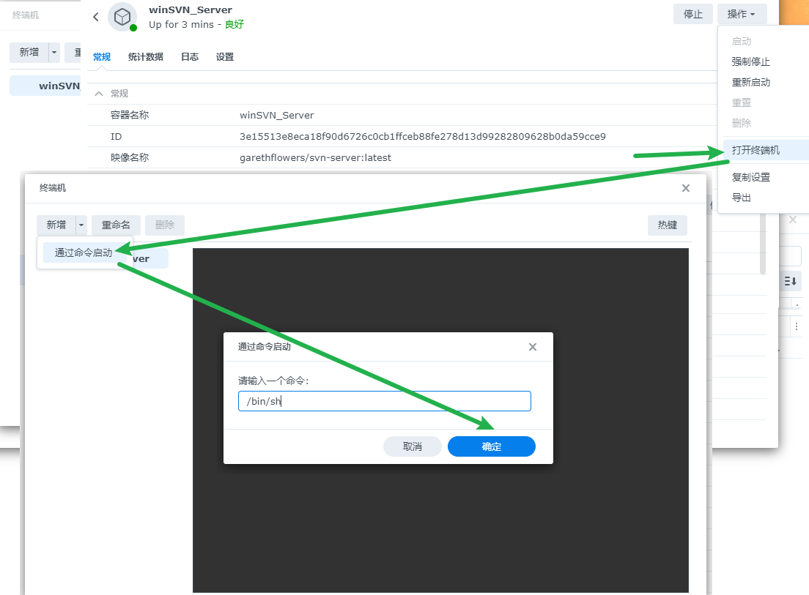
打开终端机》通过命令启动》用`/bin/sh` 来开一个交互的shell
然后我输入
```
svnadmin create WinSVN
```
来建我的第一个SVN仓库名为`WinSVN`

（以下部分参考: https://cloud.tencent.com/developer/article/1650131

然后找到`/SVN_library/SVN_Folder/WinSVN/conf`，里面是SVN的配置文件了
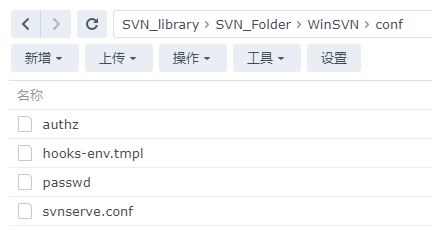
编辑`svnserve.conf`
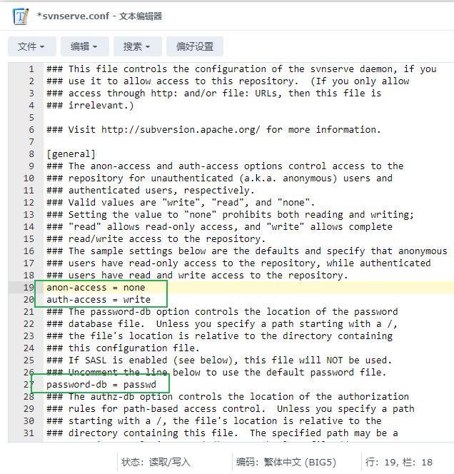

anon-access = none    #取消匿名访问
auth-access = write    #授权用户有可写权限
password-db = passwd    #指定用户配置文件，后面会用到

编辑`passwd`
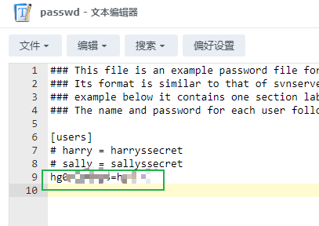
添加了自己的账户，至于分区权限我暂时用不到

记得重启容器，服务器部分好像就差不多了

最后别忘记路由器上配个3690端口转发来远程访问这个仓库，我用的是ikuai的路由OS
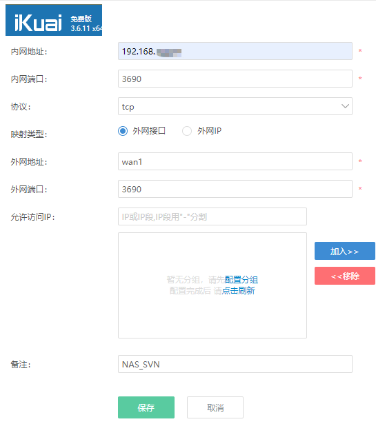

## 测试连接
pc端新建个文件夹，右键SVN CheckOut
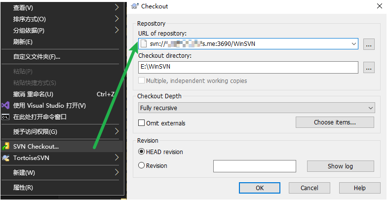
地址可以输入`svn://DDNS的域名:3690/WinSVN`，输入上面`passwd`文件里设置好的用户名和密码就好了！！

之后就是svn客户端的基本用法了，随便放一个文件尝试上传
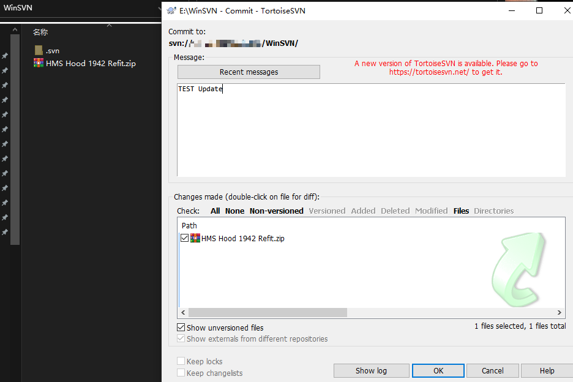
很快就传好了，至此这个SVN仓库宣告可用！
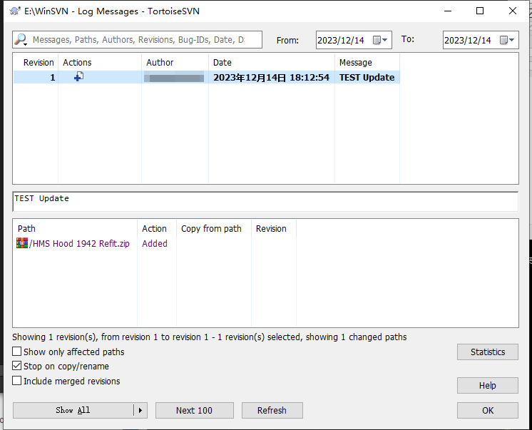